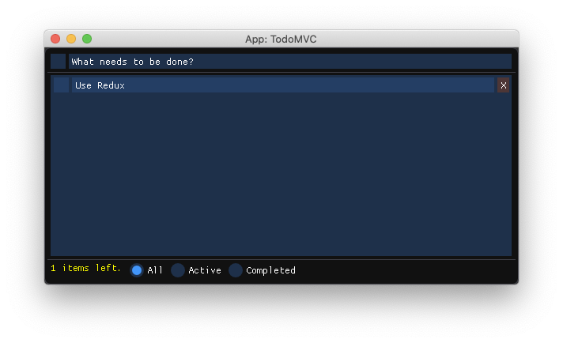

# Create App using [PackageCompilerX.jl](https://github.com/KristofferC/PackageCompilerX.jl)

## Prerequisites

- Julia-v1.3.1
- PackageCompilerX#master
- CImGui

## Build
```shell
➜  Redux git:(master) ✗ cd examples/App
➜  App git:(master) ✗ julia --startup-file=no --project  
```

```
_
_       _ _(_)_     |  Documentation: https://docs.julialang.org
(_)     | (_) (_)    |
_ _   _| |_  __ _   |  Type "?" for help, "]?" for Pkg help.
| | | | | | |/ _` |  |
| | |_| | | | (_| |  |  Version 1.3.1 (2019-12-30)
_/ |\__'_|_|_|\__'_|  |  Official https://julialang.org/ release
|__/                   |

(App) pkg> st
Project App v0.1.0
    Status `~/.julia/dev/Redux/examples/App/Project.toml`
  [5d785b6c] CImGui v1.74.2
  [6d653af8] Redux v0.1.0

julia> create_app("../App", "../AppCompiled", precompile_statements_file="precompile_app.jl", incremental=false, force=true)
┌ Warning: Package ModernGL has a build script, this might indicate that it is not relocatable
└ @ PackageCompilerX ~/.julia/dev/PackageCompilerX/src/PackageCompilerX.jl:448
[ Info: PackageCompilerX: creating base system image (incremental=false)...
[ Info: PackageCompilerX: creating system image object file, this might take a while...
[ Info: PackageCompilerX: creating system image object file, this might take a while...

julia> run(`../AppCompiled/bin/App`)
Process(`../AppCompiled/bin/App`, ProcessExited(0))
```

## Screenshot

